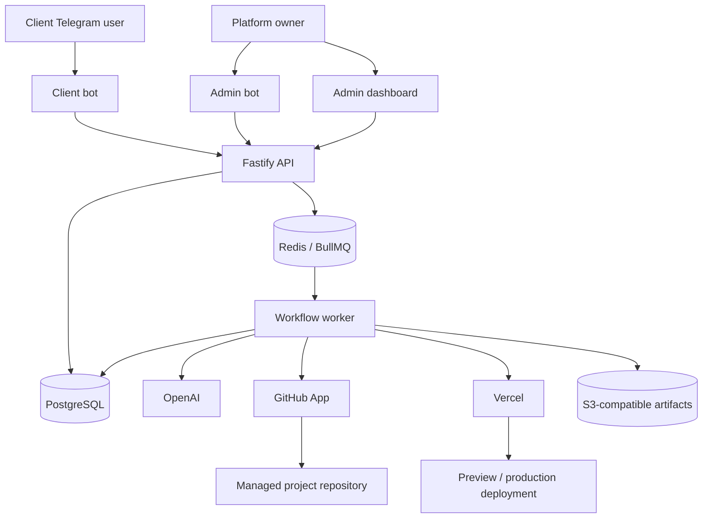

# Architecture

## Architectural style

Binflow is a modular control plane with explicit domain boundaries. The system separates synchronous ingress, durable workflow orchestration, external integration adapters and administrative presentation.

The LLM is never the control plane. It produces schema-constrained interpretations and content; policy and workflow code decide what may happen.

## System context



## Monorepo boundaries

```text
apps/
  api/          HTTP ingress, webhooks and administrative API
  worker/       Workflow execution and external side effects
  dashboard/    Nuxt administrative interface and auth endpoints
  cli/          interactive local bootstrap and encrypted integration management
  maintenance/  retention, reconciliation and scheduled health jobs
packages/
  domain/       entities, value objects, states and domain errors
  contracts/    Zod schemas and API/event contracts
  db/           Drizzle schema, migrations, RLS and repositories
  integrations/ credential lifecycle and provider-verification orchestration
  auth/         Better Auth configuration and authorization helpers
  policies/     deterministic capability and approval decisions
  tools/        declarative tool catalog, node kinds and rule composition
  workflows/    coordinator graph and capability subgraphs
  manifests/    global profile manifests and validation
  ai/           provider-neutral model interfaces and OpenAI adapter
  messaging/    Chat SDK gateway and Telegram adapters
  github/       GitHub App adapter
  vercel/       credential verification and deployment adapter
  artifacts/    S3-compatible artifact abstraction
  observability/ tracing, audit, usage and structured logging
  secrets/       provider-neutral envelope encryption and secret resolution
  onboarding/   enrollment, manifest materialization and capability catalog
  blog/         create_blog_draft deterministic executor
  integration-admin/ dashboard credential enrollment services
infra/
  compose/      local and production service definitions
  docker/       versioned container definitions
  caddy/        production reverse proxy configuration
docs/           canonical product and engineering specification
```

Dependency direction:

```text
apps → application/workflows → domain/contracts
adapters → domain ports
domain → no framework or provider package
```

Provider payloads must not cross into domain interfaces. Adapters normalize them first.

## Runtime services

### API

- Validates Telegram, GitHub and Vercel webhook authenticity.
- Resolves authenticated dashboard sessions.
- Resolves tenant from registered integration, never user-supplied tenant IDs.
- Creates idempotent commands and durable outbox events.
- Provides versioned administrative REST endpoints.
- Responds quickly and delegates long-running work.

### Administrative ingress

- Nuxt owns `/api/auth/**` and the Better Auth cookie/session lifecycle.
- Fastify owns `/api/v1/**`; dashboard pages call it through same-origin ingress.
- Caddy and the local Nuxt proxy route auth before business API paths so the two
  handlers never overlap.
- Fastify maps the authenticated session to a domain actor and performs business
  authorization independently of the UI.
- Both servers import the same `packages/auth` configuration and database schema;
  only Nuxt mounts its HTTP handler. Fastify calls the server API to resolve the
  cookie and never trusts browser-supplied actor or role fields.
- Runtime sign-up is disabled. The one platform owner is created by the local
  CLI before browser TOTP enrollment.

### Worker

- Owns the TypeScript workflow coordinator and capability executors.
- Loads frozen request configuration and secrets only when required.
- Executes deterministic adapters and records each node run.
- Pauses for input, preview or approval through graph interrupts.
- Does not offer arbitrary shell or shared worktrees to models.

### Dashboard

- Hosts Better Auth routes and English administrative UI.
- Uses the Fastify API for business operations.
- Does not connect directly to PostgreSQL from browser code.
- Masks secret metadata and never redisplays secret values.

### Maintenance

- Reconciles external state missed by webhooks.
- Enforces attachment retention and artifact cleanup.
- Checks backups, provider health and stale jobs.
- Never advances approvals or publishes without workflow policy.

### CLI

- Bootstraps the external local KEK and manages encrypted credentials before the dashboard exists.
- Reads secret values only from an interactive, non-echoed terminal prompt; secret values are never accepted as arguments.
- Calls the same SecretsProvider and integration application services used by the dashboard.
- Lists only redacted metadata and records credential lifecycle events.

## Persistence responsibilities

### PostgreSQL

Durable source for tenants, users, projects, manifests, conversations, requests, graph/node runs, checkpoints, catalog, approvals, audit and cost.

### Redis

Transient queue transport, distributed locks, rate limits, Chat SDK state and short-lived deduplication. Loss of Redis may delay work but must not lose accepted requests or approvals.

### Artifact store

Original attachments, generated images, rendered artifacts and large provider payloads. Database rows keep hashes, ownership, MIME, size, retention and storage references.

## Event consistency

- Business mutations and outbox events commit in the same PostgreSQL transaction.
- Queue jobs use stable IDs derived from command/graph identifiers.
- Consumers record idempotency keys before or atomically with effects.
- Webhook processing records provider delivery identifiers.
- Reconciliation queries external providers before retrying a potentially completed mutation.

## Multi-tenant isolation

- Tenant context is resolved from authenticated membership or integration registry.
- Domain tables contain `tenant_id` and use PostgreSQL RLS where applicable.
- Repository functions require an explicit tenant scope.
- Cross-tenant platform-owner operations use a separately audited administrative path.
- Secrets, Redis keys, artifact prefixes, bot instances and rate limits are tenant-scoped.
- Model context contains only the effective project and request data.
- Runtime repositories execute only inside an explicit transaction-scoped
  `tenant`, `platform_owner` or named system context. There is no ambient
  unscoped repository path.
- Application services use a non-owner PostgreSQL role without `BYPASSRLS`;
  migrations use a separate schema-owner credential.

## Command consistency

- Every business mutation binds an idempotency key to actor, method, route and
  canonical request hash.
- Mutable resources expose a version ETag and require `If-Match` for changes.
- Business state, its audit event and outbox event commit atomically.
- Long-running administrative work is represented by a durable operation and
  queued only after the transaction commits.

## Local and production modes

Local mode:

- Docker Compose for PostgreSQL, Redis, MinIO, ClamAV and every first-party service from Phase 0.
- API, worker and dashboard may run in containers or supervised development processes.
- Telegram uses polling to avoid a public callback dependency.
- GitHub/Vercel reconciliation polls their APIs where webhooks are unavailable.

Production mode:

- Versioned containers behind Caddy with TLS.
- Telegram, GitHub and Vercel use authenticated HTTPS webhooks.
- Persistent volumes and offsite encrypted backups.
- Non-root containers, resource limits and no Docker socket mounts.

Local and production Compose use the same versioned first-party images. Environment configuration, secret mounts, ingress and resource sizing may differ; application packaging does not.

## Extensibility

New profiles implement existing domain ports and global manifest contracts. Adding a provider or CMS must not change capability authorization semantics. Generic provider tools remain private to adapters; LLM-visible tools stay capability-specific and schema-constrained.

Post-MVP profile `astro_orbitype` (ADR-0045) enrolls with a project-scoped
Orbitype API-key credential and may activate with zero tool bindings. Content
tools for that stack are added later without widening shared port defaults
(ADR-0042).
