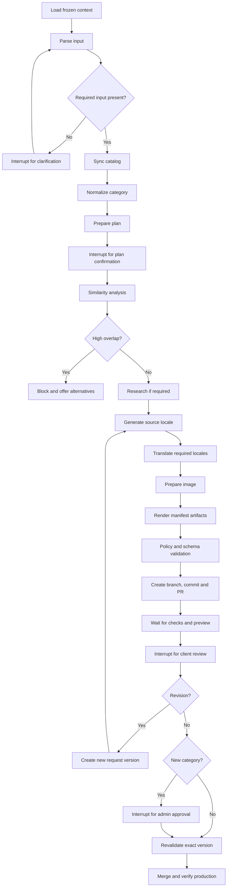

# Workflow model

## Responsibilities

LangGraph owns durable execution state, node transitions, interrupts and node-level retries. BullMQ delivers a start/resume signal using the graph run ID as job identity. PostgreSQL remains authoritative if Redis is lost.

## Request states

```text
RECEIVED
IDENTIFYING_CONTEXT
NEEDS_INPUT
PLANNED
AWAITING_PLAN_CONFIRMATION
QUEUED
GENERATING
APPLYING_CHANGE
VALIDATING
PREVIEW_DEPLOYING
PREVIEW_READY
REVISION_REQUESTED
AWAITING_CLIENT_APPROVAL
AWAITING_ADMIN_APPROVAL
APPROVED_FOR_PUBLISH
REVALIDATING
MERGING_OR_PUBLISHING
PRODUCTION_DEPLOYING
VERIFYING_PRODUCTION
COMPLETED
FAILED_RETRYABLE
FAILED_FINAL
CANCELLED
SUPERSEDED
```

Rules:

- A revision creates a new request version and marks the previous version `SUPERSEDED`.
- Approval is impossible before `PREVIEW_READY`.
- `APPROVED_FOR_PUBLISH` always transitions through `REVALIDATING`.
- Cancellation is terminal and revokes active action tokens.
- Failed transient nodes resume from the last durable checkpoint.
- A changed external source version produces a conflict, never a silent overwrite.

## Coordinator graph

1. Verify event idempotency.
2. Resolve bot, channel identity, tenant, user and project.
3. Load active manifest, enabled capabilities and conversation locale.
4. Classify intent against only the available capabilities.
5. Create or continue a request thread.
6. Route to the selected versioned capability subgraph.
7. Project workflow progress to Telegram/dashboard.
8. Finalize audit, usage, notification and retention work.

The intent planner proposes a capability; it cannot enable one, change a policy or initiate publication.

## `create_blog_draft` subgraph



## Input and plan behavior

- Brief mode starts when a topic is present.
- Missing topic produces `NEEDS_INPUT`; the model may not invent the requested subject.
- Context, audience, objective, category, keywords and research needs may be proposed.
- Plan confirmation freezes interpreted intent but not generated content.
- An empty `/create_blog` response contains input guidance, current categories and examples; it does not create a generation job until a topic is supplied.

## Category behavior

1. Compare exact normalized value against synchronized categories.
2. Use deterministic string similarity to find likely spelling errors.
3. Ask the LLM to classify only plausible candidates.
4. Require the client to confirm the interpreted value.
5. Mark a truly new category in effective policy.
6. Generate preview normally; request admin approval only after client preview approval.

Admin rejection returns the request to revision so the client can select an existing category or cancel.

## Similarity behavior

- Synchronize source changes before planning and immediately before mutation.
- Compare slug, normalized title, category, keywords, content hash and embeddings.
- Include active Binflow drafts to prevent concurrent duplicates.
- `related_expansion` must state the distinct intent and proposed internal links.
- `high_overlap` blocks create; it never silently converts into an edit capability.

## Translation node

- Translation is internal and receives finalized source content plus locale-specific project rules.
- `always_translate` generates every required content locale.
- `ask_each_action` interrupts during planning to select target locales, while still enforcing manifest-required locales.
- The node adapts idiom, examples, SEO metadata, alt text, FAQ and internal links without changing claims.
- Webbin requires Spanish and English and always runs this node.

## Preview and revision

- Branch URL may be used during iteration; approval binds to immutable commit deployment.
- Preview records deployment ID, head SHA and localized routes.
- A revision begins from the latest accepted instructions and source version, produces a new commit and invalidates all approvals.
- Preview failure exposes diagnostics but no approval/publish action.

## Publication

Before merge:

1. Re-read PR head and base branch.
2. Confirm required checks and preview readiness.
3. Confirm deployment/head SHA binding.
4. Confirm no blocked path and no unexpected file.
5. Confirm all unexpired approvals for this request version.
6. Confirm no conflict or content-catalog change.

After merge, wait for production deployment and verify expected commit, routes, metadata and status. A failure records the partial state and alerts the admin; it must not retry merge.

## Retry and idempotency

Retryable: timeouts, provider rate limits, transient 5xx responses and delayed deployment events.

Not automatically retryable: permission failure, invalid persistent schema, blocked path, content conflict, revoked credential, expired approval, budget exhaustion or deterministic validation failure.

Every external mutation must use provider idempotency when available or perform a read-before-retry reconciliation.
