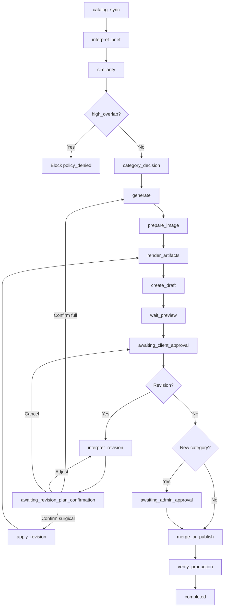

# Workflow model

## Responsibilities

The TypeScript workflow runtime owns durable execution state, node transitions,
human interrupts and capability-level retries. BullMQ delivers a start/resume
signal using the graph run ID as job identity. PostgreSQL remains authoritative
if Redis is lost. Checkpoints are append-only stage records; a retryable failure
re-enters the executor from the beginning of the current resume command.

## Request states

```text
RECEIVED
IDENTIFYING_CONTEXT
NEEDS_INPUT
PLANNED
AWAITING_PLAN_CONFIRMATION
QUEUED
GENERATING
APPLYING_CHANGE
VALIDATING
PREVIEW_DEPLOYING
PREVIEW_READY
REVISION_REQUESTED
AWAITING_CLIENT_APPROVAL
AWAITING_ADMIN_APPROVAL
APPROVED_FOR_PUBLISH
REVALIDATING
MERGING_OR_PUBLISHING
PRODUCTION_DEPLOYING
VERIFYING_PRODUCTION
COMPLETED
FAILED_RETRYABLE
FAILED_FINAL
CANCELLED
SUPERSEDED
```

Rules:

- A revision creates a new request version and marks the previous version `SUPERSEDED`.
- Approval is impossible before `PREVIEW_READY`.
- Admin **reject** (dashboard or admin Telegram, ADR-0050) transitions to
  **`CANCELLED`** and notifies the client; it does not return to client revision.
- `APPROVED_FOR_PUBLISH` always transitions through `REVALIDATING`.
- Cancellation is terminal and revokes active action tokens. A cancellation
  initiated from the dashboard also notifies the client conversation through the
  client-notification outbox (ADR-0027).
- Failed transient nodes resume from the last durable checkpoint.
- A changed external source version produces a conflict, never a silent overwrite.

## Coordinator graph

1. Verify event idempotency.
2. Resolve bot, channel identity, tenant, user and project.
3. Load active manifest, enabled capabilities and conversation locale.
4. Classify intent against only the available capabilities.
5. Create or continue a request thread.
6. Route to the selected versioned capability subgraph.
7. Project workflow progress to Telegram/dashboard.
8. Finalize audit, usage, notification and retention work.

The intent planner proposes a capability; it cannot enable one, change a policy or initiate publication.

## `create_blog_draft` subgraph

The declared graph version is `stacks/astro-repo/create-blog@1`. Plan confirmation
is a separate interrupt before execution starts. Execution checkpoints match the
executor stage names below. Spanish source and English adaptation share one
`generate` stage (one structured model call). When a confirmed plan is
`QUEUED`, the worker only starts execution if
`BINFLOW_LIVE_EXECUTION_ENABLED=true`; with the switch off the outbox row stays
pending and the request is **not** marked failed. Once execute begins, the graph
run advances `currentNode` to `catalog_sync` before loading client customization
or calling the executor, so bootstrap failures attribute to that node rather than
`plan_confirmed`. When brief input includes `context`, execution runs
`interpret_brief` after catalog sync and before similarity so the LLM can propose
a durable topic ≤500 characters without truncating the client brief (ADR-0031).



## `create_project_astro` subgraph

Graph version: resolved from `packages/tools/stacks/astro-repo/create-project/tool.yaml`
(currently `stacks/astro-repo/create-project@4`; ADR-0038). Same preview, revision,
merge and production verification spine as blog, without
`category_decision`, `awaiting_admin_approval`, or AI `prepare_image`. Adds
manifest validation stages before render and `read_project_url` after similarity
(HTTP page text + typed LLM extract; ADR-0037). Cover images come from collected
hero screenshots, re-encoded to AVIF when required (ADR-0036/0037). Telegram
command: `/create_project`. Before plan confirm, the request stays in
`NEEDS_INPUT` while closed facts are collected (base fields
`name` / year-month `fecha` / `projectDescription` plus optional customization
`content_schema`, ADR-0035/0037). Catalog sync reads portfolio slugs from
manifest `content.portfolio` directories for similarity checks. Customization
loads from DB/artifact only (no repository fallback). Webbin operators upload
`docs/customizations/webbin-create-project-astro.md` via dashboard Customizations
or `pnpm --filter @binflow/tools exec tsx scripts/upload-webbin-project-customization.ts`.

## Input and plan behavior

- Brief mode starts when a topic is present (blog) or when project closed facts
  validate (portfolio).
- Missing topic or incomplete project facts produce `NEEDS_INPUT`; the model may
  not invent the requested subject or authorize closed contracts (Zod does).
- Context, audience, objective, category, keywords and research needs may be proposed.
- Plan confirmation freezes interpreted intent but not generated content.
- An empty `/create_blog` response contains input guidance, current categories and examples; it does not create a generation job until a topic is supplied.

## Category behavior

1. Compare exact normalized value against synchronized categories.
2. Use deterministic string similarity to find likely spelling errors.
3. Ask the LLM to classify only plausible candidates.
4. Require the client to confirm the interpreted value.
5. Mark a truly new category in effective policy.
6. Generate preview normally; request admin approval only after client preview approval.

Admin rejection returns the request to revision so the client can select an existing category or cancel.

## Similarity behavior

- Synchronize source changes before planning and immediately before mutation.
- Compare slug, normalized title, category, keywords, content hash and embeddings.
- Include active Binflow drafts to prevent concurrent duplicates.
- `related_expansion` must state the distinct intent and proposed internal links.
- `high_overlap` blocks create; it never silently converts into an edit capability.

## Translation node

- Translation is internal and receives finalized source content plus locale-specific project rules.
- `always_translate` generates every required content locale.
- `ask_each_action` interrupts during planning to select target locales, while still enforcing manifest-required locales.
- `none` skips translation entirely; valid only for monolingual manifests
  (exactly one content locale).
- The node adapts idiom, examples, SEO metadata, alt text, FAQ, titles,
  subtitles and Markdown headings without changing claims.
- The English collection (`src/content/articulos/`) must not copy Spanish
  `titulo`, `seoTitulo` or heading strings. Shared slug stays Spanish-derived.
- Webbin requires Spanish and English and always runs this node.

## Preview and revision

- Content pipeline is **bundle → Markdown → GitHub → preview**, not Markdown-as-source-of-truth:
  1. Generation / surgical apply mutates a validated `blog_bundle` JSON artifact.
  2. `render_artifacts` writes bilingual `.md` files (plus cover AVIF) from that bundle.
  3. `create_draft` commits those files to the request branch/PR.
  4. `wait_preview` polls Vercel until a deployment is READY for that exact
     `headCommitSha` (transient lookup failures keep polling until the deadline).
- Durable `requests.state` advances to `PREVIEW_DEPLOYING` during
  `create_draft` / `wait_preview`, then to `AWAITING_CLIENT_APPROVAL` when the
  preview is bound and persisted.
- Surgical apply reuses the same GitHub PR: persistence updates the existing
  `pull_requests` row for that **project** + provider id rather than inserting a
  second row. Provider ids are unique per project (not globally across tenants).
- Branch URL may be used during iteration; approval binds to immutable commit deployment.
- Preview records deployment ID, head SHA and localized routes.
- A revision begins when the client taps **Request changes** (`REVISION_REQUESTED`).
  The next free-text message (or `/revise <feedback>`) creates a new request
  version and runs `interpret_revision`, which emits a structured
  `RevisionPlan` with a code-owned magnitude (ADR-0032).
- `interpret_revision` only chooses magnitude and drafts operations. It receives
  the prior article (titles, body, metadata, FAQ) as context so surgical edits
  are not limited to titles. Confirmed `body_patch` instructions are executed by
  `apply_revision` (word/paragraph add/edit/delete, idea tweaks, new facts).
- The client must confirm, adjust, or cancel the plan in
  `AWAITING_REVISION_PLAN_CONFIRMATION` before any mutation. Cancel restores
  the prior preview approval gate without invalidating the previous preview
  binding.
- Surgical magnitudes (`title_locales`, `metadata`, `body_patch`, `image_only`)
  load the prior `blog_bundle` artifact and apply only declared operations.
  `full_regenerate` re-runs generate + image. Both paths re-render, update the
  existing branch/PR when the slug is preserved, wait for a new preview, and
  invalidate prior approvals.
- Preview failure exposes diagnostics but no approval/publish action.
- `FAILED_RETRYABLE` means a transient provider failure with in-flight worker
  retries; the dashboard must not treat it as a final stop. After BullMQ
  attempts are exhausted the request becomes `FAILED_FINAL`.

## Destructive deletion (blog and portfolio)

`delete_blog_draft@2` and `delete_project_astro@2` share the destructive graph:
catalog sync → resolve target → validate → open deletion PR → admin approval →
merge → verify production 404 (polling) → completed + catalog tombstone.

- No `wait_preview`; client receives text-only notices during admin review.
- `route_still_live` after merge is retryable (CDN lag).
- Ingress live catalog sync prevents stale `*_not_found` false positives.
- Catalog sync is scoped per capability (ADR-0042): blog/delete-blog walk blog
  trees only; project/delete-project walk portfolio only. Nodes declare
  `parameters.catalogScope`; the GitHub port requires explicit `contentKinds`
  (no dual default). Ingress and execute may both sync; they share
  `content.catalog_sync@1` with the same scope until a later ADR splits kinds.

Automated tests: `packages/blog/test/delete-blog.test.ts`,
`packages/projects/test/delete-project.test.ts`,
`packages/workflows/test/delete-*-ingress.test.ts`,
`packages/workflows/test/capability-conformance.test.ts`.

Manual scenario ids (test-tool): DEL-PROJECT-01 (URL delete), DEL-PROJECT-02
(title + URL confirm), DEL-PROJECT-03 (already deleted → `project_not_found`).

## Menu update (`update_menu`, astro_orbitype)

Graph: sync pages → validate → render artifacts → open menu PR → apply Orbitype
draft → merge GitHub → publish Orbitype pages → verify production → completed.
No `wait_preview` or client preview approval; **`AWAITING_PLAN_CONFIRMATION`**
is the sole client gate (`confirm_plan`).

- Telegram collection: PDF upload → multi-select menu CTAs → plan summary with
  public PDF URL → execute on confirm.
- Dual-write: versioned `public/documents/menu-{date}-{suffix}.pdf` on GitHub
  plus `pages.sections` href patches on Orbitype.
- Runtime kind `update_menu`; catalog sync scope `pages` with empty
  `contentKinds` (Orbitype list, not GitHub tree walk).

Automated tests: `packages/menu/test/update-menu.test.ts`,
`packages/workflows/test/update-menu-ingress.test.ts`,
`packages/workflows/test/capability-conformance.test.ts`.

## Text edit (`edit_text`, astro_orbitype)

Graph: sync editable copy → validate → render patch → open text PR → wait
preview → apply Orbitype preview (snapshot + temp patch) → client approval →
admin approval → merge → publish Orbitype pages → verify production →
completed.

- Collection: optional locale (multilingual) → target substring → disambiguation
  → confirm target → replacement text → plan confirm.
- Literal old→new patch only (no LLM rewrite); denylist H1/CTA/nav/footer.
- **Preview writes Orbitype temporarily** so CMS-backed sites show the change;
  snapshot restored on client cancel / admin reject (`restore_orbitype_preview`).
- Runtime kind `edit_text`; catalog scope `pages`.

Automated tests: `packages/text/test/`,
`packages/workflows/test/edit-text-ingress.test.ts`,
`packages/workflows/test/capability-conformance.test.ts`.

## Image edit (`edit_image`, astro_orbitype)

Graph: sync editable images → validate → render patch → open image PR → wait
preview → apply Orbitype preview (snapshot + absolute preview asset URL) →
client approval → admin approval → merge → publish Orbitype pages/posts
(relative path) → verify production → completed.

- Collection (no locale pick): target search → numbered disambiguation →
  confirm with **current image photo** (or reject and search again) →
  replacement (Telegram photo or HTTPS URL) → plan confirm.
- Multilingual: one asset patches every `contentLocales` for the slot.
- Allowlist: page section images (not page heroes / logos) and blog images
  including cover/hero (`SectionPostHero` / `posts.img`).
- **Preview writes Orbitype temporarily** with absolute Vercel preview asset
  URL (avoids live 404 on PR-only relative paths). Cancel/reject restores
  snapshot via `restore_orbitype_preview`. Post-merge publish uses relative path.
- Dual-write assets: `public/images/blog/edit-*` plus CMS mirrors.
- Admin `admin_approval_required` notice includes Vercel preview URL(s).
- Runtime kind `edit_image`; catalog scope `pages` (posts via Orbitype port).

Automated tests: `packages/images/test/`,
`packages/workflows/test/edit-image-ingress.test.ts`,
`packages/workflows/test/capability-conformance.test.ts`.

## Publication

Before merge:

1. Re-read PR head and base branch.
2. Confirm required checks and preview readiness.
3. Confirm deployment/head SHA binding.
4. Confirm no blocked path and no unexpected file.
5. Confirm all unexpired approvals for this request version.
6. Confirm no conflict or content-catalog change.

After merge, persist the merge commit SHA, wait for production deployment and verify expected commit, routes, metadata and status. Client-visible production URLs use the Webbin pilot origin `https://webbin.com.mx`. Unique `*.vercel.app` deployment hostnames are never client-visible production URLs. A failure records the error category and message, then alerts the admin. The merge PUT is not retried blindly: a later publication resume re-reads the PR, treats an already-merged PR bound to the approved head as success, and continues production verification.

The Module 8 executor implements this graph through typed provider ports. It
persists a checkpoint after catalog sync, generation, artifact validation, PR
creation, preview readiness, every approval and publication. Provider calls are
never replayed from an in-memory position alone. A deployment-level live
execution switch can stop all provider mutations without making a request or
approval valid.

## Retry and idempotency

Retryable: timeouts, provider rate limits, transient 5xx responses and delayed deployment events.

Not automatically retryable: permission failure, invalid persistent schema, blocked path, content conflict, revoked credential, expired approval, budget exhaustion or deterministic validation failure.

Every external mutation must use provider idempotency when available or perform a read-before-retry reconciliation.
