# Create project astro — capability specification

Capability id: `create_project_astro@1`  
Stack: `astro_repo`  
Executor: `workflow.create_project@1`  
Command: `/create_project`  
Graph: `stacks/astro-repo/create-project@4`

Canonical decision: [ADR-0034](../adr/0034-create-project-astro-reusable-tool.md),
amended by [ADR-0035](../adr/0035-project-content-schema-dsl-and-collection-loop.md),
[ADR-0036](../adr/0036-portfolio-hero-screenshot-cover.md), and
[ADR-0037](../adr/0037-project-year-month-url-evidence-avif-cover.md)  
Supersedes: `docs/specs/create-project-draft.md` (historical Webbin-first draft)

Layer tags: `[CODE]` invariant tool base · `[MANIFEST-*]` per-project structure ·
`[CUSTOMIZATION]` uploaded markdown · `[WEBBIN-ONLY]` pilot expectations

---

## 1. Three layers

| Layer | Owner | Examples |
|-------|-------|----------|
| Tool base `[CODE]` | Binflow repo | Graph, executor, minimal closed facts, `project_bundle.v1`, neutral template |
| Manifest `[MANIFEST-*]` | Enrollment per project | Collection dirs, route prefixes, `sectionHeadings`, `enumFields`, editable paths |
| Customization `[CUSTOMIZATION]` | Operator upload | Voice + allowlisted `## content_schema` fields — **not** paths, models, or approvals |

Webbin pilot: manifest block in `buildProjectManifest` + upload
`docs/customizations/webbin-create-project-astro.md` via dashboard (or
`pnpm --filter @binflow/tools exec tsx scripts/upload-webbin-project-customization.ts` locally).

---

## 2. Content contract

### Bundle envelope `[CODE]`

`project_bundle.v1` — validated JSON intermediate artifact; Markdown is rendered output.

Shared fields: `slug` (kebab-case, 3–90 chars), `fecha` (`YYYY-MM-01` after
normalize), `confidencial`, `destacada`, `url?`, `imagen?`, `imagePrompt`,
`rationale`, localized `en` / `es` case studies.

Localized case study fields: `descriptor`, `clienteTipo`, `industria`, `rol`, `tipo`,
`estado`, `resumen`, `impacto`, `stack[]`, `sections.{challenge,solution,outcome}`.

`tipo` and `estado` values are strings validated against manifest `enumFields` when present.

### Body headings `[MANIFEST-*]`

Renderer emits H2 headings from `content.portfolio.sectionHeadings` per locale.
Webbin pilot:

| Locale | Directory | Headings |
|--------|-----------|----------|
| EN | `src/content/proyectos/` | Challenge, Solution, Outcome |
| ES | `src/content/proyectos-es/` | Reto, Solución, Resultado |

Other clients define their own headings (e.g. Brief / Design / Delivery).

### Editorial style + content schema `[CUSTOMIZATION]`

Uploaded markdown sections matching the neutral template:

- `content_schema` — optional allowlisted YAML fields collected before generation
  (ADR-0035/0037). Reserved base fact ids: `name`, `fecha`, `projectDescription`,
  `category`, `images` (legacy `description` aliases to `projectDescription`).
  Allowlisted types include `yearMonth` and `image`.
- `generate`, `interpret_revision`, `apply_revision` — style guidance.
- Cover images are client-provided hero screenshots when `type: image` fields
  are required (ADR-0036); the tool re-encodes to AVIF (ADR-0037).

---

## 3. Capability inputs `[CODE]`

### Shared optional fields (brief / structured)

- `publicationIntent`: `draft` (default) | `publish` — publish requires `url`
- `image.mode`: `generate` (default) | `omit` | `provided`
- `clientProfile`: audit label only; runtime resolves customization by `projectId`
- `confidencial`, `destacada`, `fecha`, `url`, `stack`, `tipo`, `estado`, `notes`
- `urlEvidence?`: typed extract from `read_project_url` (runtime)

### Mode `collect`

Telegram collection loop. Stores partial `closedFacts` and `messages` while the
request is in `NEEDS_INPUT`. Completes when base facts plus required customization
fields validate; then transitions to brief + `AWAITING_PLAN_CONFIRMATION`.

### Mode `brief`

Natural-language brief and/or completed `closedFacts`; executor generates bundle
then validates. Closed-fact metadata merges deterministically after generate.

### Mode `structured`

Operator supplies partial or full `project_bundle`; may skip `generate`.

### Mode `revision`

Post-preview feedback; resumes through ADR-0032 revision plan flow.

---

## 4. Graph pipeline `[CODE]`

```mermaid
flowchart LR
  catalog[catalog_sync] --> sim[similarity]
  sim --> readUrl[read_project_url]
  readUrl --> gen[generate]
  gen --> norm[normalize_project_bundle]
  norm --> val[validate_project_bundle]
  val --> priv[validate_privacy_and_evidence]
  priv --> repo[repo_contract_checks]
  repo --> render[render_artifacts]
  render --> draft[create_draft]
  draft --> preview[wait_preview]
  preview --> approve[awaiting_client_approval]
```

Revision loop: `interpret_revision` → `awaiting_revision_plan_confirmation` →
`surgical apply_revision` or full `generate` → validation chain → preview again.
Full regenerate re-enters at `generate` (URL evidence from the prior run may be
reused when still present on the request).

Cover: client-provided hero screenshot (artifact) when required by customization;
re-encoded to AVIF under `imageDirectory`. `image.mode: omit` yields Markdown-only
drafts. AI cover generation is not used (ADR-0036).

---

## 5. Typed validation errors `[CODE]`

| Code | When |
|------|------|
| `high_content_overlap` | Similarity ≥ 0.9 against catalog |
| `project_slug_collision` | Slug exists in portfolio catalog |
| `invalid_enum_value` | `tipo` / `estado` outside manifest enums |
| `cover_image_required` | Provided cover required but missing |
| `publication_url_required` | `publicationIntent: publish` without `url` |
| `manifest_portfolio_missing` | Manifest has no `content.portfolio` |
| `project_url_fetch_failed` | `read_project_url` could not fetch usable page text and no `projectDescription` grounding is available |

---

## 6. Webbin pilot manifest `[MANIFEST-WEBBIN]`

Paths, enums and headings in `packages/manifests/src/index.ts` `content.portfolio`.
Capability binding: `create_project_astro@1` with `client_publish` access.
Editable cover paths include `public/images/projects/*.jpg` and
`public/images/projects/*.avif`. After changing cover encoding, rematerialize
the active enrollment manifest (local helper:
`pnpm --filter @binflow/tools exec tsx scripts/refresh-webbin-manifest-avif-paths.ts`)
so `render_artifacts` does not fail the path boundary check.

Upload editorial customization from `docs/customizations/webbin-create-project-astro.md`
(Dashboard → Customizations → Webbin → `create_project_astro`).

---

## 7. Verification

- Graph `@4` loads with `read_project_url`.
- Base facts score `projectDescription` + `YYYY-MM` fecha.
- AVIF cover path/mime; slash + DM photo close image fields without `[image]` poison.
- Deterministic metadata merge from closed facts.
- Webbin customization upload succeeds with the rewritten schema.
