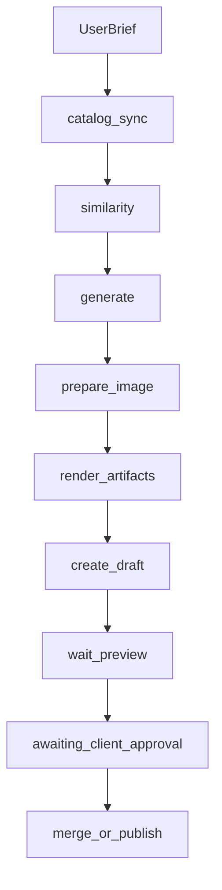

# Create project draft — capability specification

Capability id: `create_project_draft@1`  
Stack: `astro_repo`  
Executor: `workflow.create_project@1`  
Command: `/create_project`

This document is the Webbin-derived specification for Binflow implementation. Tags: `[CODE]`, `[TOOL-YAML]`, `[CUSTOMIZATION]`, `[WEBBIN-ONLY]`.

---

## 1. Content contract

### Frontmatter `[CODE]`

| Field | Type | Rules | Source |
|-------|------|-------|--------|
| `descriptor` | string | Descriptive title; never real client/project name | LLM + validator |
| `clienteTipo` | string | Anonymized client type | LLM |
| `industria` | string | Industry sector | LLM |
| `rol` | string | Role; default `Design and development` | LLM / input |
| `tipo` | enum | `Sitio web` \| `Landing page` \| `Aplicacion web` \| `Ecommerce` (Spanish in both locales) | LLM / input |
| `estado` | enum | `Publicado` \| `En progreso` \| `Concepto` | LLM / input |
| `fecha` | date | `YYYY-MM-DD`; list sort desc | input |
| `resumen` | string | 1–2 sentences | LLM |
| `impacto` | string | What changed; no invented metrics | LLM |
| `stack` | string[] | Real technologies | LLM / input |
| `url` | url optional | Required before publish; only field that may name real product | input |
| `imagen` | string optional | `/images/projects/{slug}.jpg` | generated or omitted |
| `confidencial` | boolean | default true; anonymizes narrative, not URL | input |
| `destacada` | boolean | default false; home page when true | input |

### Body sections `[CODE]`

| Locale | Directory | H2 headings |
|--------|-----------|-------------|
| EN | `src/content/proyectos/` | `Challenge`, `Solution`, `Outcome` |
| ES | `src/content/proyectos-es/` | `Reto`, `Solución`, `Resultado` |

Section guidance (Webbin editorial):

- **Challenge / Reto:** 2–4 paragraphs. Problem, constraints, why generic solutions failed. No client names.
- **Solution / Solución:** 3–6 paragraphs. Architecture, integrations, your role. Technical but readable.
- **Outcome / Resultado:** 2–4 paragraphs. Delivered capabilities. Explicit disclaimer when metrics are unverified.

`confidencial: true` — generic industry language; no identifying details beyond `url`.  
`confidencial: false` — may name product/company in narrative when user supplied public URL (e.g. vaton.io).

### Slug `[CODE]`

- kebab-case from descriptor, max 80 chars
- Same filename in EN and ES collections
- Stable across surgical revisions when `preservesSlug: true`
- Collision: reject if slug exists in catalog unless revision of same request

---

## 2. Capability inputs

### Mode `brief` `[CODE]`

```json
{
  "mode": "brief",
  "projectId": "019fef7e-63d1-755d-bbed-1fca769353c5",
  "brief": "Headless Nuxt site with Calendly booking for language courses…",
  "url": "https://www.example.com/",
  "tipo": "Sitio web",
  "estado": "Publicado",
  "fecha": "2026-06-01",
  "destacada": true,
  "confidencial": true,
  "stack": ["Nuxt 3", "Vue", "Orbitype"],
  "sourceLocale": "es"
}
```

Invalid example: missing `brief` → `validation_error`.

Hard requirements before plan confirm: `brief`, `projectId`.  
Hard requirements before publish: `url` on bundle.

### Mode `structured` `[CODE]`

User supplies partial or full `project_bundle` JSON; executor validates and may skip generate.

### Mode `revision` `[CODE]`

Post-preview feedback via ADR-0032 `RevisionPlan` (reuse magnitudes: `metadata`, `body_patch`, `image_only`, `full_regenerate`).

---

## 3. Artifact pipeline



### `project_bundle` `[CODE]`

Intermediate JSON artifact (persisted like `blog_bundle`).

### Rendered paths `[CODE]`

- `src/content/proyectos/{slug}.md`
- `src/content/proyectos-es/{slug}.md`
- `public/images/projects/{slug}.jpg` (optional)

Preview routes:

- `/proyectos/{slug}`
- `/es/proyectos/{slug}`

Branch pattern: `bot/webbin/{capability}/{request-id}-{slug}` with `{capability}` → `create-project`.

Image: optional; UI shows 16:9 placeholder. IA generates cover when node runs; publish allowed without image.

---

## 4. Invariants vs customization

### Invariants `[CODE]`

- No real client/project names in descriptor, clienteTipo, body (except via public `url` context)
- `tipo` / `estado` Spanish enums in both locales
- EN/ES slug parity
- No invented metrics in `impacto` / Outcome
- `url` required at approval
- `/proyectos` noindex (Webbin `[WEBBIN-ONLY]`)

### Customization `[CUSTOMIZATION]`

See `packages/tools/stacks/astro-repo/create-project/customization-template.md` and `customizations/webbin.md`.

---

## 5. Workflow graph `[TOOL-YAML]`

Differs from blog:

- No `category_decision`, no `awaiting_admin_approval`
- Same preview / revision / publish spine as blog
- Predicate `similarity.is_not_high_overlap` before generate

---

## 6. Deterministic validation `[CODE]`

| Check | Fail message |
|-------|--------------|
| Bundle schema | Model output failed schema validation |
| Slug unique | Project slug already exists |
| URL at approval | Publication requires project URL |
| H2 headings | Missing required section |
| ES/EN not copy | English must be idiomatic adaptation |
| PR file set | Unexpected file set |
| No new commit | Draft file update did not produce a new commit |

---

## 7. Open questions (resolved for v1)

1. **Image:** IA generates optional cover; user may omit; placeholder OK for preview/publish.
2. **Publish without image:** Allowed.
3. **destacada:** User input only; model must not set without input.
4. **Home limit:** None enforced in v1 `[WEBBIN-ONLY]`.
5. **Revision slug:** Preserved by default.
6. **Admin approval:** Not used for projects.
7. **URL domain:** Warn only in v1; block unverified domains in future ADR.
8. **Catalog sync:** Yes — load existing portfolio slugs/descriptors for similarity.

---

## 8. Fixtures

See `packages/projects/test/fixtures/` for:

1. `typical-confidential.json` + rendered MD pair
2. `featured-public.json` + rendered MD pair
3. `revision-body-patch.json` before/after bundles

---

## 9. Telegram / dashboard

- Command: `/create_project <brief>`
- States: same spine as blog (`PREVIEW_DEPLOYING`, `AWAITING_CLIENT_APPROVAL`, …)
- `terminal_result`: slug, previewUrls, headCommitSha, pullRequestUrl, destacada, approvalStatus
